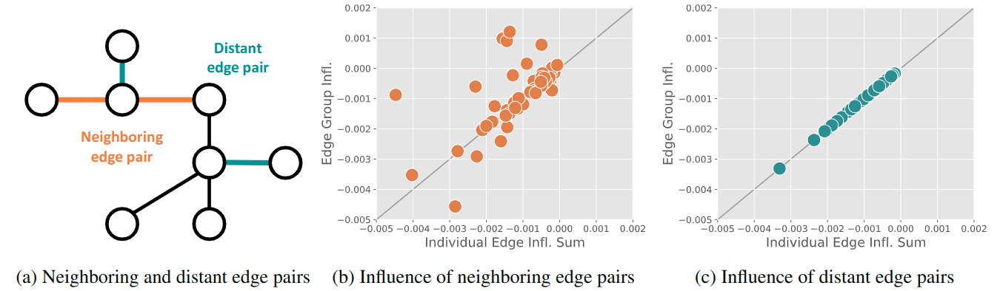

# RGE: A Repulsive Graph Rectification for Node Classification via Influence

## Introduction

Official Pytorch implementation of ICML 2023 paper "RGE: A Repulsive Graph Rectification for Node Classification"



This work scrutinizes the trend that there exists an influence estimation error of an edge group in graph influence function and this error might decrease the peroformance in graph rectification. However, for a pair of distant edges (where each edge affects the representation of different train nodes), we observe and theoretically show the estimation error is zero. Thus, we propose RGE, which eliminates distant edges at each iteration in graph rectification, and demonstrate the effectiveness of RGE on various graphs.

## Commands

* Pretraining SGC
    ```
    CUDA_VISIBLE_DEVICES=0 python -m pretrain.main \
    --dataset Cora \
    --data_dir ./data \
    --lr 0.2 \
    --weight_decay 8.5e-6
    ```

* Identifying the opponent edges (lr and weight decay should be the same with HP used in pretraining SGC)
    ```
    CUDA_VISIBLE_DEVICES=0 python -m rge.main_retrain \
    --dataset Cora \
    --data_dir ./data \
    --lr 0.2 \
    --weight_decay 8.5e-6
    ```

## Hyper-Parameters (HP) for pretraining SGC
* Homophilous graphs

| HP (SGC) | Cora | CiteSeer | PubMed | Photo | Computers |
|---|---|---|---|---|---|
| learning rate | 0.2 | 0.5 | 0.2 | 0.2 | 0.2 |
| weight decay | 8.5e-6 | 8.5e-6 | 8.5e-6 | 5e-7 | 1e-7 |

* Heterophilous graphs

| HP (SGC) | Cornell | Wisconsin | Texas | Actor | Squirrel |
|---|---|---|---|---|---|
| learning rate | 0.2 | 0.2 | 0.2 | 0.2 | 0.2 |
| weight decay | 2e-6 | 3e-5 | 4e-5 | 1e-5 | 1e-7 |


## Performance of pretrainted SGC
* Homophilous graphs

| Method (Acc.) | Cora | CiteSeer | PubMed | Photo | Computers |
|---|---|---|---|---|---|
| SGC | 81.00 | 71.90 | 78.90 | 90.22 | 86.65 |
| RGE | 84.50 | 73.75 | 82.80 | 91.64 | 88.85 |

* Heterophilous graphs

| Method (Acc.) | Cornell | Wisconsin | Texas | Actor | Squirrel |
|---|---|---|---|---|---|
| SGC | 54.32 | 64.90 | 63.24 | 31.21 | 40.54 |
| RGE | 56.32 | 68.84 | 63.24 | 31.64 | 40.93 |

## Dependencies
This code has been tested with

* Python == 3.8.10
* JAX == 0.3.17
* Haiku == 0.0.9.dev
* Jraph == 0.0.6.dev0
* Pytorch == 1.13.0+cu117
* Pytorch Geometric == 2.1.0